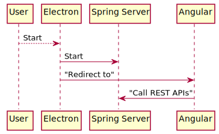

# Introduction

## Overview

Brooke is a personal solution for, first, a book reader for digitized books, and second for
launching videos archived from DVDs and Blu-Rays.  Books are in cbt (Comic Book Tar) archives,
and videos are in MKV files.

Brooke is an Angular web application, backed with a Java Spring server, wrapped in Electron.

Electron launches the Java application. The Angular web application is served from the embedded Spring
server.

<!--
@startuml overview

User -[dotted]-> Electron: Start
Electron -> "Spring Server": Start
Electron -> Angular: "Redirect to"
Angular -> "Spring Server": "Call REST APIs"

@enduml
-->



## Purpose

The purpose of this document is to record the design of Brooke for future reference.  Much of the content
is notes about the application rather than a formal design document.

## History

This is not the first implementation of the Brooke solution. A brief synopsis of prior iterations, and why they were abandoned:

- Concatenated PDFs.  The first solution was to concatenate scanned PDFs together into a single file.  This resulted in some extremely large files, and as a consequence had very poor performance in applications when viewing.

- Utilizing open source Comic Book readers (ComicRacks, etc) with cbz files. No suitably performant solution was found.

- Java web application with slide shows.  Books were htlm files with a bunch of loose PNGs.  This lead to many loose files sitting around, elongating any operation against the book. (Moving files, etc)

- Java web application with cbt and Thymeleaf.  The closest to the current solution, this was a Thymeleaf Spring application.  This solution was modified to use Electron and Angular to remove the outdated  server side rendering.

## Document Conventions

This document is created using markdown with a couple preprocessing steps.  

## Document Preprocessing

### Linking to Files

The preprocessing allows for linking to Epics defined in the source using 
Comment Anchors in Visual Studio Code.  The epics in question outline code
that is then copied into the output files.  The following example copies content
for the starting_angular epic into the output below.

	@LINK starting_angular

```java

import javax.servlet.http.HttpServletRequest;
import javax.servlet.http.HttpServletResponse;

import org.springframework.boot.autoconfigure.web.ErrorProperties;
import org.springframework.boot.autoconfigure.web.servlet.error.BasicErrorController;
import org.springframework.boot.web.servlet.error.ErrorAttributes;
import org.springframework.http.HttpStatus;
import org.springframework.stereotype.Component;
import org.springframework.web.bind.annotation.RequestMapping;
import org.springframework.web.servlet.ModelAndView;

@Component
public class CustomErrorController extends BasicErrorController {

    public CustomErrorController(ErrorAttributes errorAttributes) {
        super(errorAttributes, new ErrorProperties());
    }

    @RequestMapping(produces = "text/html")
    @Override
    public ModelAndView errorHtml(HttpServletRequest request, HttpServletResponse response) {
        HttpStatus status = getStatus(request);
        if (status == HttpStatus.NOT_FOUND) {
            return new ModelAndView("forward:/");
        } else {
            return super.errorHtml(request, response);
        }
    }
}
```

### PlantUML

This documentation uses PlantUML to generate images for UML diagrams.  The plant UML text
is inside HTML quotes, and then linked to. [node-plantuml](https://www.npmjs.com/package/node-plantuml) is used to create the PlantUML graphics

<!--
@startuml firstDiagram

Alice -[dotted]-> Bob: Hello
Bob -> Alice: Hi!
	
@enduml
-->

