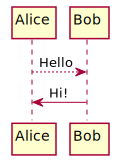

# Overview

## Overview / Purpose / History / Doc conventions, preprocessing


## Purpose

## History

## Document Conventions

This document is created using markdown with a couple preprocessing steps.  

## Document Preprocessing

### Linking to Files

The preprocessing allows for linking to Epics defined in the source using 
Comment Anchors in Visual Studio Code.

	@LINK starting_angular

```java

import javax.servlet.http.HttpServletRequest;
import javax.servlet.http.HttpServletResponse;

import org.springframework.boot.autoconfigure.web.ErrorProperties;
import org.springframework.boot.autoconfigure.web.servlet.error.BasicErrorController;
import org.springframework.boot.web.servlet.error.ErrorAttributes;
import org.springframework.http.HttpStatus;
import org.springframework.stereotype.Component;
import org.springframework.web.bind.annotation.RequestMapping;
import org.springframework.web.servlet.ModelAndView;

@Component
public class CustomErrorController extends BasicErrorController {

    public CustomErrorController(ErrorAttributes errorAttributes) {
        super(errorAttributes, new ErrorProperties());
    }

    @RequestMapping(produces = "text/html")
    @Override
    public ModelAndView errorHtml(HttpServletRequest request, HttpServletResponse response) {
        HttpStatus status = getStatus(request);
        if (status == HttpStatus.NOT_FOUND) {
            return new ModelAndView("forward:/");
        } else {
            return super.errorHtml(request, response);
        }
    }
}
```


### PlantUML

This documentation uses PlantUML to generate images

<!--
@startuml firstDiagram

Alice -[dotted]-> Bob: Hello
Bob -> Alice: Hi!
	
@enduml
-->

